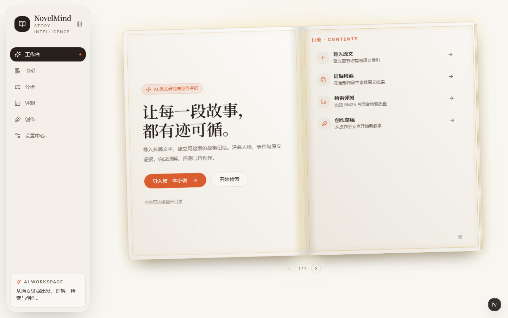
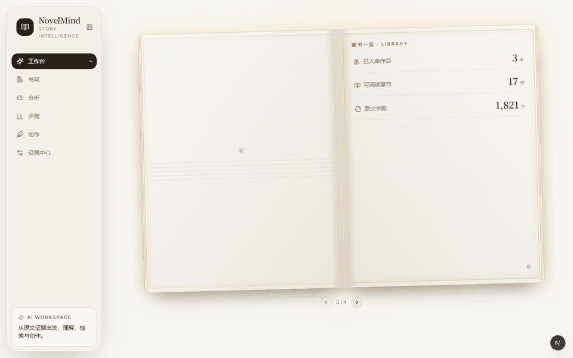
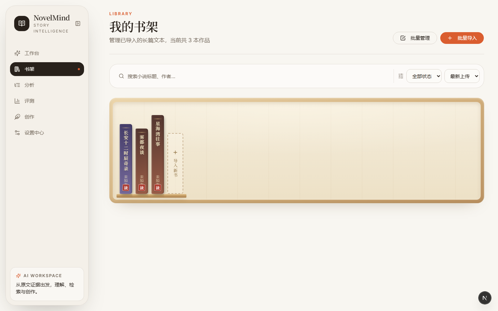
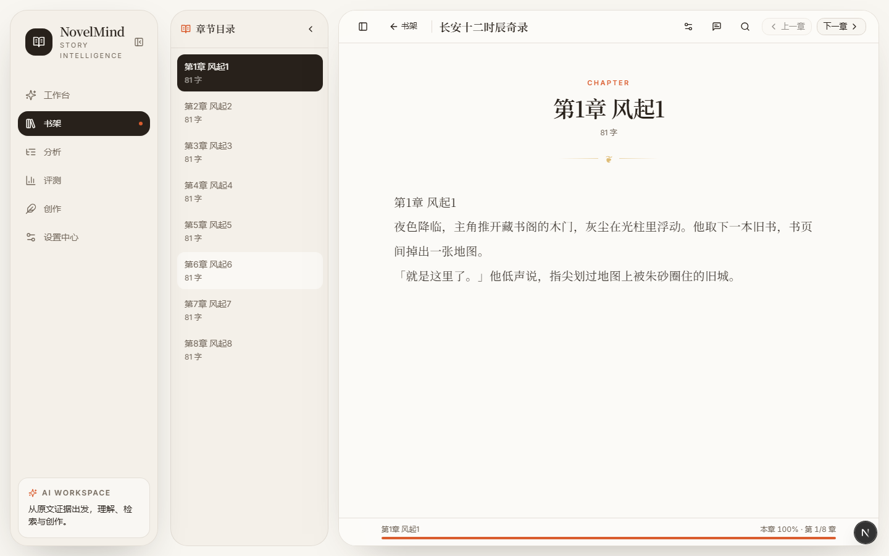
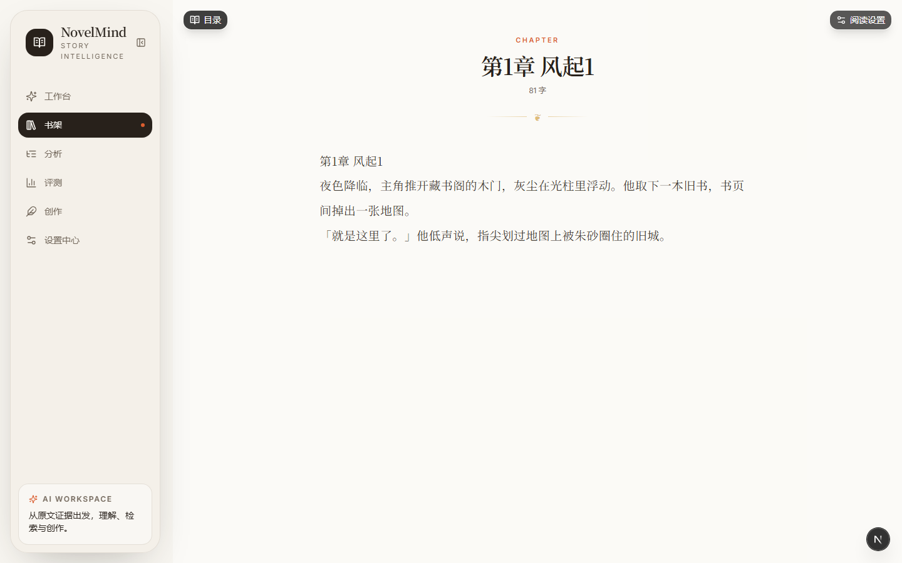
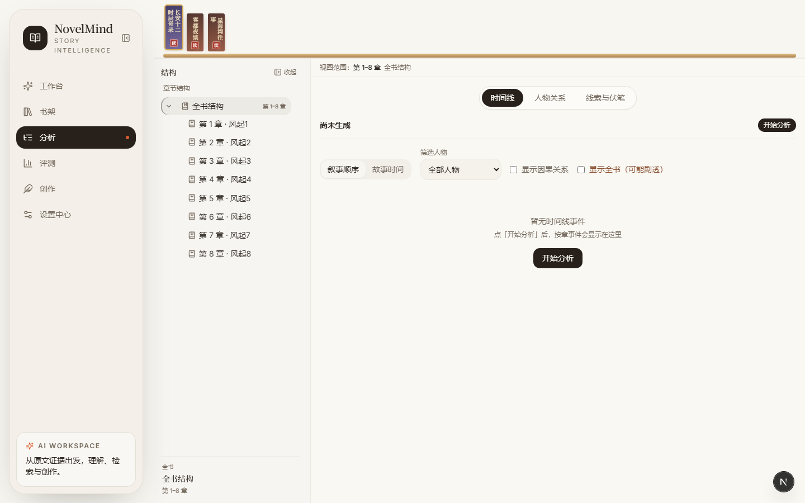

# NovelMind

NovelMind 是一个 AI 辅助小说理解与同人创作平台：导入长篇 TXT，自动建立章节结构与语义索引，沿着人物、事件与原文证据完成理解、检索、评测与再创作。当前已具备安全账户体系、小说导入与阅读、持久化导入任务、用户级模型配置、端到端 RAG、混合搜索、RAG 评测闭环、叙事记忆（结构树/时间线/人物关系/线索伏笔）与创作工作台。

实际实现状态以 [IMPLEMENTATION-STATUS.md](IMPLEMENTATION-STATUS.md) 为准。

## 功能展示

### 首页 · 3D 互动翻页书

整页一本倾斜开卷的书：纸张感翻页（页面弯折 + 流动书影）、金色光环与光尘、描金书页。封面即导览，目录、最近作品与藏书一览都在书页里，可直接点击跳转。





### 书架 · 仿真书架

已入库的书竖立摆上原木层架：书厚按字数、书高错落、书脊烫金书名与状态印章。点击书本，书会从架上飞出、放大并翻开封面，随后进入阅读。




### 阅读 · 书页排版与沉浸模式

衬线大标题、金色分隔符、宽松行距的书页式排版；章节目录侧栏、进度记忆、选章即读。沉浸模式下只剩文字，目录与阅读设置化作悬浮入口，随用随取。





### 分析 · 结构工作台

顶部书脊选书条，左侧记忆树（章节名直接来自原文标题），右侧大画布切换时间线、人物关系与线索伏笔；剧透上限随阅读进度自动约束可见范围。



## Current Baseline

- 后端：FastAPI、SQLAlchemy async、PostgreSQL 16 + pgvector
- 前端：Next.js 16.3.0-canary.6、React 19、TypeScript、Tailwind CSS；「书本」视觉系统（翻页书首页、仿真书架、书页阅读器），支持桌面侧栏和移动底部导航
- AI：LiteLLM 1.83.10+；项目支持 Python 3.11-3.13，不支持 Python 3.14
- 安全：HttpOnly Cookie/Bearer JWT、资源所有权隔离、版本化 Fernet 加密、出站主机白名单与 DNS/IP 校验
- 验证：后端 236 tests、前端 229 tests、生产构建、ESLint、TypeScript、Ruff、Bandit、pip-audit、npm audit、Alembic PostgreSQL 检查均通过
- UI 验收：登录、工作台、书架、评测和设置已在 1280px 桌面与 390px 移动端浏览器验证，无控制台错误
- GSD：`.planning/` 是唯一 AI 状态目录；v0.3 当前为 gaps_found，评测质量闭环仍在验收

## Repository Layout

```text
novel-mind/
├── backend/              FastAPI、ORM、迁移和测试
├── frontend/             Next.js 应用和前端测试
├── docs/                 面向维护者的工程与产品文档（含展示图片）
├── .planning/            AI 规划、状态和任务文档（GSD 工作流）
├── docker-compose.yml    PostgreSQL 和 Chroma 开发服务
└── IMPLEMENTATION-STATUS.md
```

## Local Development

前置要求：Python 3.11-3.13、Node.js 20.9+、Docker Desktop。

```powershell
docker compose up -d db chroma

cd backend
py -3.11 -m venv .venv
.\.venv\Scripts\python.exe -m pip install -r requirements.txt -r requirements-dev.txt
Copy-Item .env.example .env
.\.venv\Scripts\python.exe -m alembic upgrade head
.\.venv\Scripts\python.exe -m uvicorn app.main:app --reload --host 127.0.0.1 --port 8010

cd ..\frontend
npm install
$env:BACKEND_URL = "http://127.0.0.1:8010"
npm run dev -- --port 3005 --hostname 127.0.0.1

cd ..\agent-service
npm install
# agent-service 调 FastAPI /api/gateway 必须注入网关令牌（backend/.env:39 定义）
$env:NOVELMIND_GATEWAY_TOKEN = "dev-agent-gateway-token-local"
$env:FASTAPI_BASE_URL = "http://127.0.0.1:8010"
$env:PORT = 3100
node start.mjs
```

- 前端：`http://localhost:3005`
- 后端：`http://localhost:8010`
- OpenAPI：`http://localhost:8010/docs`
- agent-service：`http://localhost:3100`（SSE agent run；AI 自动路由 skill，不暴露给用户）
- ZCodeProxy（真实生图代理）：`http://localhost:3001`（可选；未启动时用 `illustration_provider=mock`）

> 端口固化：后端 8010（避开 rag-api 的 8000）、前端 3005、agent-service 3100、ZCodeProxy 3001。
> 一键保活全部服务可用 `scripts/keep-alive.ps1`（已注入网关令牌）。

首次注册的活跃账户成为引导管理员，并接管迁移前的历史小说和模型记录。生产环境必须替换 `.env.example` 中的 JWT 与数据加密密钥，并启用 Secure Cookie。

## Verification

```powershell
cd backend
.\.venv\Scripts\python.exe -m pytest -q
.\.venv\Scripts\python.exe -m ruff check app tests migrations
.\.venv\Scripts\python.exe -m bandit -r app -ll -q
.\.venv\Scripts\python.exe -m pip_audit --local --skip-editable
.\.venv\Scripts\python.exe -m alembic current
.\.venv\Scripts\python.exe -m alembic check

cd ..\frontend
npm test
npm run lint
npm run build
npm audit --registry=https://registry.npmjs.org
```

文档入口：
- [产品与工程文档](docs/README.md)
- [架构设计文档](docs/architecture/README.md) — 11 篇系统结构文档 + Mermaid 图

## License

MIT
