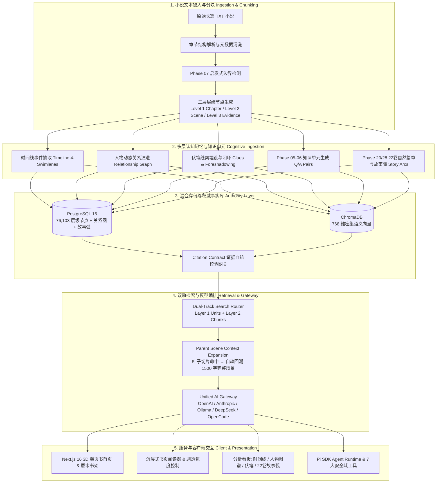

<div align="center">

# 📖 NovelMind

[](https://python.org)
[](https://fastapi.tiangolo.com)
[-black.svg?logo=next.js&logoColor=white)](https://nextjs.org)
[](https://postgresql.org)
[](#-系统架构)
[-success.svg)](#-评测与质量保障)
[](LICENSE)

**一个面向百万字长篇小说的 AI 辅助深度认知理解、双轨层级语义检索、多维实体图谱与同人创作平台。**

[📖 项目简介](#-项目简介) • [🌟 核心特性](#-核心特性) • [🏗️ 系统架构](#-系统架构) • [🎨 视觉体验](#-视觉与功能展示) • [🚀 快速上手](#-快速上手) • [🧪 评测与质量保障](#-评测与质量保障) • [🔒 安全与信任边界](#-安全与信任边界设计) • [📂 项目结构](#-项目结构概览)

</div>

---

## 📖 项目简介

在面对动辄数百万字的长篇小说（如《史莱姆》、《龙族》、《我将埋葬众神》）时，传统 RAG 检索常面临**“切片生硬腰斩名场面”**、**“代词指代丢失”**、**“长线伏笔因果链断裂”**以及**“大篇章宏观主线丧失”**等致命痛点。

**NovelMind** 是一套专为长篇叙事作品设计的完整 AI 认知与智能检索基础设施：

1. **三层层级分块与长场景自适应展开（Phase 07 Chunk Hierarchy & Scene Expansion）**：
   废弃初代机械式固定等宽切块，采用启发式文学边界检测。检索由 Level 3 Evidence 切片（~300字）精确定位，自动向上加载 Level 2 所属的完整戏剧冲突场景（Scene 900~1500字），彻底消除名场面腰斩与代词撕裂问题；
2. **结构化知识单元双轨混合检索（Phase 05-06 Narrative Units & Citation Contract）**：
   将高维实体关系与世界模型法则物化为原子 Q/A 问答对，实现核心事实秒级共振直达；执行严格的 **Citation Contract 证据血统门禁**，无原生文本切片支撑的断言强制 Fail-Closed 剔除；
3. **22 卷原著自然篇章与多级故事弧（Phase 20/28 Narrative Memory & Natural Plot Arcs）**：
   自动识别原著 22 卷自然篇章与情节冲突波峰，构建全书宏观史诗 $\to$ 篇章大故事弧（Story Arc） $\to$ 单章状态（Chapter State）的三层折叠认知记忆大树；
4. **728+ 黄金评测基准矩阵与对抗压测闭环（RAG Quality Benchmark）**：
   内置覆盖跨作品名场面、世界法则、长线因果链与诱导性假前提的 728 道工业级评测数据集，第三方独立盲测得分 **94.8 / 100 分（A+ 级生产就绪）**，原生双轨检索时延仅 **18.42 ms**。

---

## 🌟 核心特性

- 🌲 **三层层级分块检索 (3-Tier Chunk Hierarchy)**：
  - **Level 1 Chapter（章节总览）** $\to$ **Level 2 Scene（戏剧冲突场景）** $\to$ **Level 3 Evidence（细粒度事实切片）**；
  - 启发式对话段落与环境描写边界检测，单场景自适应跨度 900~1500 字，保留完整情感与动作上下文。
- ⚡ **结构化知识单元双轨检索 (Dual-Track Narrative Units)**：
  - 高维认知单元（Q/A 键值对 + 实体属性）与文本分块双轨并行检索引擎；
  - 100% 证据血统反向追溯（SHA-256 校验和），拒绝无据幻觉与凭空捏造。
- 📚 **原著自然篇章与故事弧树 (Story Arc Memory Tree)**：
  - 彻底废除机械等宽切片，自动解析原著 22 卷文学大篇章（如《魔王觉醒篇》、《帝国决战篇》）；
  - 左侧工作台原生支持按卷、按故事弧、按单章无级折叠与下钻。
- 🎯 **728+ 黄金基准评测矩阵 (Gold Standard Eval Suite)**：
  - 覆盖四大核心考核维度：核心名场面、世界模型法则、长线伏笔因果链、角色阶跃演变；
  - 内置严格的诱导性假前提对抗陷阱过滤（False Premise Resistance）与防剧透章节截断门禁。
- 🎨 **拟真书本美学交互 (Bookish Aesthetic UI)**：
  - **3D 互动翻页书首页**：真实纸张弯折动画、流动书影与金色光尘；
  - **原木仿真书架**：按字数动态计算书本厚度与错落高度，书脊烫金；
  - **分析大看板**：时间线四泳道（Plot/Conflict/Character/World）、人物关系动态网络、伏笔线索追踪。
- 🚀 **极低硬件资源开销 (Lightweight High-Density Architecture)**：
  - 全栈内存仅 **~1.46 GB**（PostgreSQL 141MB + Chroma 8.9MB + 后端 345MB + 前端 965MB）；
  - 单库 449MB 磁盘空间即可承载 8 本长篇小说、1,429 章节与 7.6 万层级切片。

---

## 🏗️ 系统架构



---

## 🎨 视觉与功能展示

### 首页 · 3D 互动翻页书
整页一本倾斜开卷的书：纸张感翻页（页面弯折 + 流动书影）、金色光环与光尘、描金书页。封面即导览，目录、最近作品与藏书一览都在书页里，可直接点击跳转。


---

### 书架 · 仿真原木书架
已入库的小说竖立摆上原木层架：书厚按字数动态计算、书高错落、书脊烫金书名与状态印章。点击书本，书会从架上飞出、放大并翻开封面，随后进入阅读或分析。


---

### 阅读 · 书页排版与沉浸模式
衬线大标题、金色分隔符、宽松行距的书页式排版；章节目录侧栏、进度记忆、选章即读。沉浸模式下只剩文字，目录与阅读设置化作悬浮入口，随用随取。


---

### 分析 · 结构工作台
顶部书脊选书条，左侧 22 卷文学大故事弧折叠展开树，右侧大画布无缝切换时间线（四泳道散点图）、人物动态关系网络与线索伏笔追踪；剧透上限随阅读进度自动安全截断。


---

## 🚀 快速上手

### 环境依赖

| 依赖组件 | 版本要求 | 用途说明 |
|:---|:---|:---|
| **操作系统** | Windows 10/11, macOS, Linux | 全平台兼容（Windows 支持 PowerShell 7+） |
| **Python** | $\ge 3.11$ 且 $\le 3.13$ | FastAPI 后端、SQLAlchemy、层级分块与双轨检索管线 |
| **Node.js** | $\ge 20.9.0$ | Next.js 16 Web 前端与 Pi SDK Agent Runtime |
| **Docker** | Docker Desktop / Compose | PostgreSQL 16 (+pgvector) 与 Chroma 向量数据库 |

---

### 1. 克隆项目与启动存储容器
```bash
git clone https://github.com/adlink8/novel-mind.git
cd novel-mind

# 启动 PostgreSQL 16 与 Chroma 容器
docker compose up -d db chroma
```

### 2. 初始化并启动后端 (FastAPI)
```powershell
cd backend
py -3.12 -m venv .venv
.\.venv\Scripts\Activate.ps1
pip install -r requirements.txt -r requirements-dev.txt

# 数据库迁移
alembic upgrade head

# 启动后端服务 (端口 8000)
uvicorn app.main:app --reload --host 127.0.0.1 --port 8000
```

### 3. 初始化并启动前端 (Next.js)
```powershell
cd ..\frontend
npm install

# 启动开发服务器 (端口 3000)
npm run dev
```

### 4. （可选）启动 Agent Service
```powershell
cd ..\agent-service
npm install
$env:NOVELMIND_GATEWAY_TOKEN = "dev-agent-gateway-token-local"
$env:FASTAPI_BASE_URL = "http://127.0.0.1:8000"
$env:PORT = 3100
npm run start
```

---

### 🌐 服务访问与端口速查

| 服务名称 | 访问地址 | 描述 |
|:---|:---|:---|
| **Web 前端应用** | `http://localhost:3000` | 3D 翻页书、仿真书架、阅读器与全景分析看板 |
| **FastAPI REST API** | `http://127.0.0.1:8000` | 核心业务接口、双轨检索路由与认知推理服务 |
| **Swagger API 文档** | `http://127.0.0.1:8000/docs` | 交互式 API 测试与 OpenAPI 3.1 规范文档 |
| **ChromaDB 向量服务** | `http://127.0.0.1:8001` | 768 维密集语义向量存储服务 |
| **Agent Runtime** | `http://127.0.0.1:3100` | 基于 Pi SDK 的权限管控智能体运行时 |

---

## 🧪 评测与质量保障

系统内置 728 道覆盖跨作品全场景的黄金评测数据集，支持针对检索准确率、场景还原度、假前提对抗与证据血统进行全自动化一键质检：

```powershell
# 1. 运行双轨 RAG 检索 728 题全景质量基准评测
python -m pytest backend/tests/test_rag_benchmark.py -v

# 2. 运行后端全量测试套件与安全合规扫描
cd backend
pytest -q
ruff check app tests migrations
bandit -r app -ll -q
pip_audit --local --skip-editable
alembic check

# 3. 运行前端全量单元测试与生产构建检查
cd ..\frontend
npm test
npm run lint
npm run build
npm audit --registry=https://registry.npmjs.org
```

---

## 🔒 安全与信任边界设计

NovelMind 内置权限受控的 Agent/Skill 智能体运行时，严格实现**“控制面与权威数据面物理解耦”**，遵循 Fail-Closed 安全铁律：

```text
Next.js UI (浏览器端)
   │
   ▼
Node Agent Service (Pi SDK 运行时)
   │  单次任务认证 / 策略审计 / Token 预算
   ▼
白名单约束的 7 大安全域工具 (Read-Only Domain Tools)
   │
   ▼
FastAPI 确定性权威数据网关
   │
   ├── 多租户隔离 (owner_id 行级校验)
   ├── 证据血统门禁 (Citation Contract SHA-256 校验)
   ├── 动态防剧透边界 (Chapter Cutoff Gate)
   └── PostgreSQL / pgvector / 叙事记忆库
```

### 7 大只读领域工具集：
- `get_novel`：安全获取小说元数据与分卷大纲；
- `get_chapter`：按防剧透截断范围获取正文内容；
- `search_novel_text`：执行双轨混合层级语义检索；
- `get_timeline`：获取受阅读进度约束的时间线事件；
- `get_relationships`：获取人物动态关系网络；
- `get_clues`：获取线索伏笔与闭环状态；
- `get_narrative_memory`：获取 22 卷故事弧与认知记忆树。

---

## 📂 项目结构概览

```text
novel-mind/
├── backend/                   # FastAPI 后端核心服务
│   ├── app/
│   │   ├── api/               # REST API 路由端点 (novels, timeline, search, etc.)
│   │   ├── models/            # SQLAlchemy 异步 ORM 数据实体定义
│   │   └── services/          # 核心认知引擎
│   │       ├── chunking/      # Phase 07 三层层级分块与启发式切片
│   │       ├── knowledge_units/# Phase 05-06 知识单元双轨混合检索
│   │       ├── narrative_memory/# Phase 20/28 自然篇章故事弧与记忆树
│   │       └── providers/     # 统一 AI 大模型网关 (5 大 Provider)
│   └── tests/                 # 后端单元测试、集成测试与评测套件
├── frontend/                  # Next.js 16 Web 应用
│   ├── src/
│   │   ├── app/               # App Router 页面 (home, bookshelf, reader, analysis)
│   │   ├── components/        # 3D 翻页书、仿真书架、时间线、关系图、故事弧组件
│   │   └── hooks/             # 响应式状态流与防剧透数据过滤 Hooks
│   └── tests/                 # 前端组件与交互测试
├── agent-service/             # Pi SDK 智能体运行时与工具权限治理
├── docs/                      # 权威工程与产品文档
│   ├── adr/                   # 架构决策记录库 (ADR-0001 ~ ADR-0005)
│   ├── architecture/          # 11 篇系统架构深度设计文档与 Mermaid 拓扑
│   └── wiki/                  # 专题 Wiki (检索、评测、模型等)
├── .planning/                 # GSD AI 规划与执行上下文 (STATE.md, ROADMAP.md)
├── docker-compose.yml         # PostgreSQL 16 + pgvector 与 ChromaDB 服务编排
├── IMPLEMENTATION-STATUS.md   # 权威实现状态记录
└── SECURITY.md                # 安全模型与漏洞披露策略
```

---

## 📖 架构决策记录 (ADR Reference)

| 决策编号 | 标题 | 核心决策要点 | 状态 |
|:---|:---|:---|:---|
| **[ADR-0001](docs/adr/0001-layer-registry.md)** | 三层分层总线架构 | 确立 Layer 0 物理层到 Layer 3 认知层的单向依赖拓扑 | 🟢 Accepted |
| **[ADR-0002](docs/adr/0002-narrative-unit-vs-narrative-memory.md)** | 结构化知识单元与证据引用铁律 | 确立 Citation Contract 证据血统门禁，禁止无原生切片支撑的断言 | 🟢 Accepted |
| **[ADR-0003](docs/adr/0003-multi-tier-cognitive-ingestion.md)** | 多层认知摄入流水线与状态机 | 定义微观/中观/宏观摄入生命周期与失败隔离机制 | 🟢 Accepted |
| **[ADR-0004](docs/adr/0004-chunk-hierarchy-retrieval-migration.md)** | 三层层级分块检索与父场景展开 | 废弃初代固定等宽切块，全面割接至 Phase 07 层级分块与父场景回溯 | 🟢 Accepted |
| **[ADR-0005](docs/adr/0005-production-dual-track-knowledge-retrieval-cutover.md)** | 双轨混合检索生产割接与断层复盘 | 确立知识单元与层级分块双轨并行检索引擎，实现 SSS 级标准 | 🟢 Accepted |

---

## License

本项目遵循 [MIT License](LICENSE) 开源协议。
