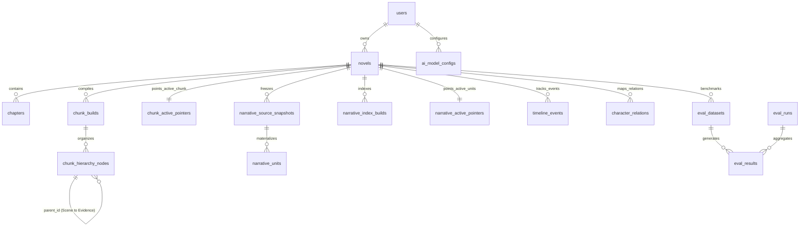

# 03 — 数据模型与实体关系 (Data Models & Entity Relationships)

NovelMind 使用 PostgreSQL 16 作为主数据库，ChromaDB 作为多集合向量存储。系统严格遵循 `owner_id` 多租户隔离、版本化不可变快照（Immutable Snapshots）与指针原子切换（Active Pointer Switching）规范。

---

## 核心实体与领域模型

### 1. 基础小说域 (Core Novel Domain)

* **User (`users`)**: 用户账户体系，bcrypt 密码哈希、JWT 会话绑定与多租户所有权根节点；
* **Novel (`novels`)**: 小说主表，存储标题、作者、总字数、导入状态、阅读进度（`reading_progress`）与文风指纹；
* **Chapter (`chapters`)**: 章节表，存储章节序号、标题、正文文本与字数。

---

### 2. Phase 07 三层层级分块域 (Chunk Hierarchy Domain)

**来源**: `backend/app/models/chunk_hierarchy.py`, `chunk_build.py`，权威规范详见 [ADR-0004](file:///d:/ADLINK/Myproject/novel-mind-new/docs/adr/0004-chunk-hierarchy-retrieval-migration.md)。

| 表名 (Table) | 主键与外键 | 核心字段 | 职责与说明 |
|---|---|---|---|
| `chunk_hierarchy_nodes` | `id` (PK), `novel_id` (FK), `parent_id` (FK 自关联) | `level` (1=Chapter, 2=Scene, 3=Evidence), `content`, `char_start`, `char_end`, `node_metadata` | 存储三层分块树节点；支持从 Evidence 向上解析 Scene 场景 |
| `chunk_builds` | `id` (PK), `novel_id` (FK), `owner_id` (FK) | `build_key`, `manifest_checksum`, `node_count`, `status` | 不可变分块编译快照，SHA-256 签名校验 |
| `chunk_active_pointers` | `id` (PK), `novel_id` (FK), `owner_id` (FK) | `build_id` (FK), `pointer_version`, `activated_at` | 当前活跃分块指针，支持零停机原子切换与瞬时回滚 |

---

### 3. Phase 05-06 结构化知识单元域 (Narrative Units Domain)

**来源**: `backend/app/models/knowledge_unit.py`，权威规范详见 [ADR-0002](file:///d:/ADLINK/Myproject/novel-mind-new/docs/adr/0002-narrative-unit-vs-narrative-memory.md) 与 [ADR-0005](file:///d:/ADLINK/Myproject/novel-mind-new/docs/adr/0005-production-dual-track-knowledge-retrieval-cutover.md)。

| 表名 (Table) | 主键与外键 | 核心字段 | 职责与说明 |
|---|---|---|---|
| `narrative_source_snapshots` | `id` (PK), `novel_id` (FK), `owner_id` (FK) | `manifest_checksum`, `source_watermark`, `item_count`, `status='frozen'` | 冻结已通过门禁的关系事实，生成不可变数据快照 |
| `narrative_units` | `id` (PK), `canonical_id`, `novel_id` (FK), `source_judgment_id` (FK), `primary_evidence_id` (FK) | `question`, `answer`, `subject_key`, `relation_type`, `confidence`, `evidence_count`, `status='active'` | **知识单元本体**：具象化 Q/A 问答对，强制关联底层切片证据（Citation Contract） |
| `narrative_index_builds` | `id` (PK), `novel_id` (FK), `owner_id` (FK) | `build_key`, `collection_name`, `manifest_checksum`, `unit_count`, `status='committed'` | 知识单元向量索引构建版本 |
| `narrative_active_pointers` | `id` (PK), `novel_id` (FK), `owner_id` (FK) | `build_id` (FK), `pointer_version`, `active_manifest_checksum`, `activated_at` | 知识单元生产活跃检索指针 |

---

### 4. 认知分析与图谱实体域 (Analysis & Graph Domain)

* **Phase 08 时间线 (`timeline_events`) [VERIFIED]**: 结构化叙事事件，存储 `novel_id`, `chapter_id`, `event_type`, `summary`, `timestamp_order`（样例已入库 1,933 条事件）；
* **Phase 09 人物关系 (`character_relations`) [VERIFIED]**: 角色关系网络，存储 `source_name`, `target_name`, `relation_type`, `evolution_stage`（样例已入库 41 条 accepted 关系）；
* **Phase 11 线索伏笔 (`clue_candidates`, `clue_judgments`) [VERIFIED]**: 伏笔追踪与闭环判定，记录伏笔埋设章与揭示章（`plant_chapter` $\to$ `payoff_chapter`）；
* **Phase 04 知识关系抽取 (`knowledge_relation_candidates`, `knowledge_relation_judgments`, `knowledge_evidence_refs`)**: 实体关系抽取流水线与审核证据链。

---

### 5. 质量评估与基准评测域 (Evaluation Domain)

* **`eval_datasets`**: 黄金评测基准题库（**728+ 用例已入库**），包含 `question`, `question_type`, `difficulty`, `expected_points`, `must_not_say`, `gold_chunks`, `status`；
* **`eval_runs`**: 评测运行批次（已完成 Runs 17~24），记录 `run_name`, `dataset_name`, `strategy_metrics`（Recall, Precision, MRR, NDCG, Latency）；
* **`eval_results`**: 单题评测明细与错误案例追溯。

---

## 数据库完整实体关系拓扑 (Entity Relationship Topology)

---

## 多租户隔离与安全铁律 (Security & Ownership)

1. **统一行级 `owner_id` 过滤**：所有针对小说、章节、分块、知识单元、时间线与评测数据的 API 操作，必须强制执行 `owner_id == current_user.id` 校验；
2. **越权请求统一返回 404**：防止攻击者通过 403 探测资源的存在性；
3. **API Key 强制加密存储**：AI 模型密钥使用 Fernet 对称加密（前缀 `enc:v1`），禁止任何明文落地。
