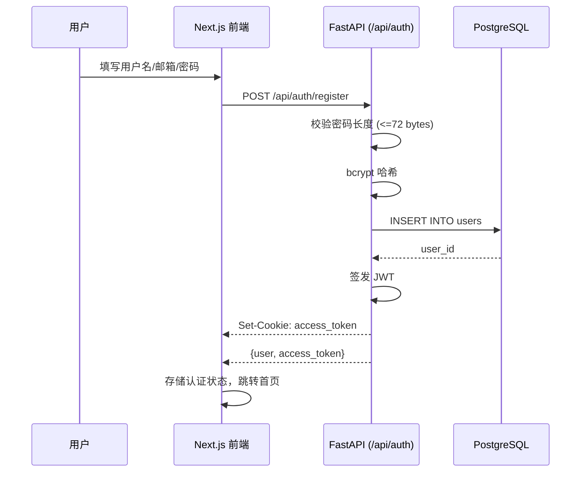
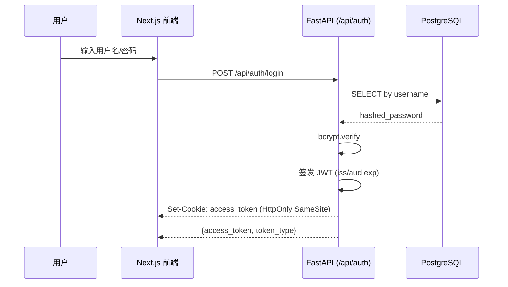
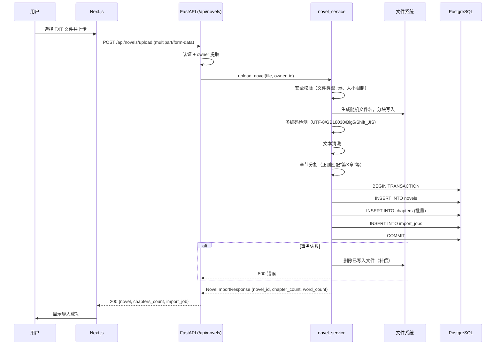
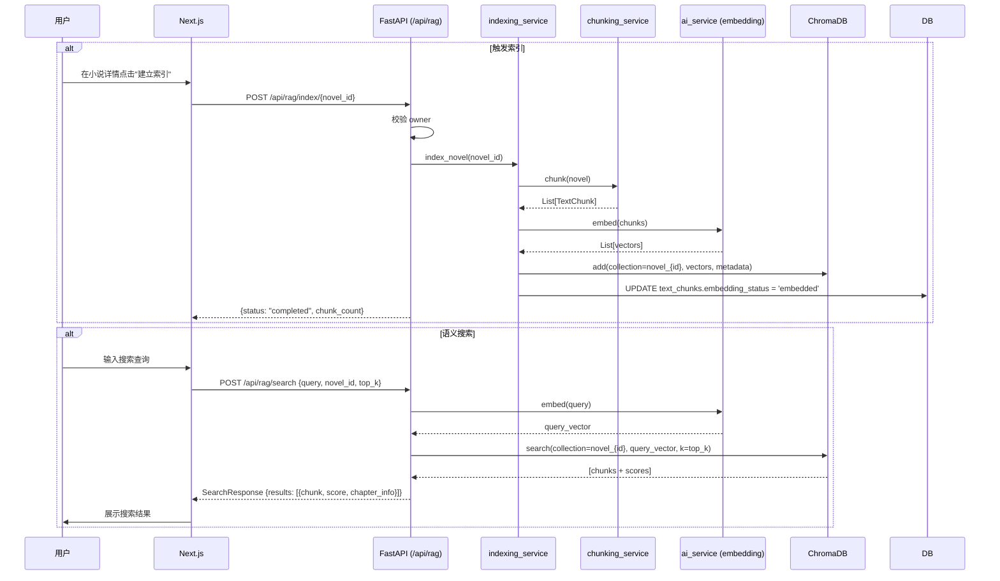

# 04 — 请求与业务流

描述 NovelMind 主要请求链路的完整流程，包括认证、小说导入、阅读、RAG 检索等。

## 认证流程

### 注册



### 登录



### 认证中间件

所有 API 请求（除 health/register/login/logout）都经过以下认证链：

```
HTTP 请求
  → dependencies.get_current_user
    → 从 Cookie 中提取 access_token
    → 若 Cookie 不存在，从 Authorization: Bearer 提取
    → JWT 验证（签名、iss/aud、过期时间）
    → 查询数据库确认用户存在且 is_active
    → 注入 current_user 到路由处理函数
  
  写请求额外校验：Origin 头必须在 CORS 白名单中
```

**来源**:
- `backend/app/api/dependencies.py` — `get_current_user`
- `backend/app/core/security.py` — JWT 签发/验证
- `backend/app/api/auth.py` — 注册/登录/注销端点

---

## 小说导入流程



**来源**:
- `backend/app/services/novel_service.py` — 进口核心逻辑
- `backend/app/services/import_service.py` — 任务状态管理
- `backend/app/api/novels.py` — 上传端点

---

## 小说阅读流程

```mermaid
sequenceDiagram
    participant U as 用户
    participant F as Next.js 阅读器
    participant B as FastAPI (/api/novels)
    participant DB as PostgreSQL

    U->>F: 点击小说
    F->>B: GET /api/novels/{id}
    B->>B: 校验 owner_id == current_user.id
    B->>DB: SELECT novel (不含 source_path)
    DB-->>B: {id, title, author, chapter_count, word_count, ...}
    B-->>F: NovelResponse

    U->>F: 点击章节
    F->>B: GET /api/novels/{id}/chapters/{chapter_id}
    B->>B: 校验 novel.owner_id == current_user.id
    B->>DB: SELECT chapter
    DB-->>B: {id, chapter_number, title, content, word_count}
    B-->>F: ChapterResponse
    F->>U: 渲染章节内容

    Note: 阅读进度暂存于 Novel.reading_progress 字段
```

---

## RAG 语义搜索流程



**来源**:
- `backend/app/api/rag.py` — RAG 端点
- `backend/app/services/chunking_service.py` — 分块
- `backend/app/services/indexing_service.py` — 索引管线
- `backend/app/services/vector_store.py` — ChromaDB 封装
- `backend/app/services/ai_service.py` — embedding 调用

---

## AI 模型配置流程

```mermaid
sequenceDiagram
    participant U as 用户
    participant F as Next.js 设置页
    participant B as FastAPI (/api/models)
    participant CR as crypto (Fernet)
    participant DB as PostgreSQL

    U->>F: 添加 AI 模型
    F->>B: POST /api/models {name, provider, api_key, ...}
    B->>B: 校验 owner
    B->>CR: encrypt(api_key)
    CR-->>B: "enc:v1:..." 密文
    B->>DB: INSERT INTO ai_model_configs
    DB-->>B: model_id
    B-->>F: AIModelConfigResponse (不含 api_key)

    Note: 读取时自动解密。API key 在 Response 中永远不返回
```

---

## 请求安全防御链

每个非公开 API 请求经过以下防御层：

```
1. CORS 中间件 → 校验 Origin 头
2. TrailingSlash 中间件 → 规范化 URL
3. RequestLogging 中间件 → 结构化日志（脱敏）
4. 认证依赖 → get_current_user → JWT 验证
5. Owner 依赖 → 权限校验 → 404 或 403
6. SSRF 校验 → url_security（仅 provider URL 调用时）
7. 输入校验 → Pydantic schema 验证
8. 响应序列化 → 脱敏（去掉 source_path、api_key 等）
```
