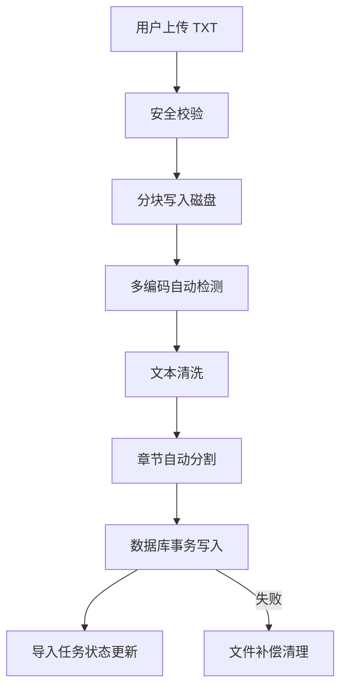

# 05 — 小说导入管线

TXT 小说从上传到入库的完整处理流程。

## 管线概览



## 各阶段详解

### 1. 安全校验

| 检查项 | 规则 | 来源 |
|---|---|---|
| 文件类型 | 只接受 `.txt` | `novel_service.py` |
| 文件大小 | 默认上限配置化 | `config.py` |
| 文件名 | 随机十六进制生成，防止路径遍历 | `novel_service.py` |
| 路径 containment | 写入前校验目标路径在 `uploads/` 目录内 | `novel_service.py` |

### 2. 文件写入

```
multipart 流式接收
  → 生成随机文件名 (uuid)
  → 64KB 分块读取 + 写入
  → 原子重命名到最终路径
  → 读取上限保护
```

写入路径：`backend/uploads/{随机十六进制名称}`

### 3. 多编码检测

按优先级尝试以下编码，以第一个解码成功且无常见乱码特征的编码为准：

| 编码 | 使用场景 | 代码路径 |
|---|---|---|
| UTF-8 | 现代通用 | `novel_service.py` |
| GB18030 | 国标，中文小说最常用 | `novel_service.py` |
| Big5 | 繁中/中国台湾地区小说 | `novel_service.py` |
| Shift_JIS | 日文小说 | `novel_service.py` |

检测策略：尝试解码 → 检查是否含替代字符（`\ufffd`）→ 检查常见乱码特征 → 回退到下一个编码。

### 4. 文本清洗

- 去除空行和纯空白行
- 统一换行符为 `\n`
- 去除 BOM 头（UTF-8 BOM `\ufeff`）
- 保留原文字符（不转换全角/半角）

### 5. 章节分割

使用正则匹配章节标题模式：

```
第[一二三四五六七八九十百千万0-9]+[章节卷]
Chapter \d+
第\d+章
```

分割策略：

1. 扫描全文，定位所有章节标题行
2. 在相邻标题之间切分段落
3. 序言/前言作为第 0 章
4. 每章记录 chapter_number、title、content、word_count

### 6. 数据库事务

```python
async with db.begin():
    novel = Novel(owner_id=..., title=..., ...)
    db.add(novel)
    await db.flush()  # 获取 novel.id

    for chapter in chapters:
        db.add(Chapter(novel_id=novel.id, ...))

    import_job = ImportJob(novel_id=novel.id, status="ready")
    db.add(import_job)

# 事务失败 → 删除已写入的文件
```

### 7. ImportJob 状态机

```
pending → uploading → detecting → parsing → chunking → embedding → ready
                                                                 ↓
                                                            failed → (retry)
```

| 字段 | 含义 |
|---|---|
| `status` | 当前阶段 |
| `progress` | 0-100 百分比 |
| `retry_count` | 已重试次数 |
| `max_retries` | 最大重试（默认 3） |
| `error_detail` | 失败时存储错误详情 |

## 已验证

| 测试 | 结果 |
|---|---|
| 《龙族Ⅰ·火之晨曦》导入 | 539KB GB18030，11 章 / 274,011 字，成功 |
| 多编码测试 | UTF-8、GBK、GB18030、Big5 全部通过 |
| 上传安全测试 | 非 .txt 文件被拒绝 |
| 删除补偿测试 | 数据库失败时文件被清理 |
| owner 隔离测试 | 跨用户访问返回 404 |

## 测试文件

- `backend/tests/test_novels.py` — 导入端点测试
- `backend/tests/test_security.py` — 上传安全测试

## 已知局限

1. **同步执行**：当前导入是同步的，大文件（>5MB）可能超时
2. **进度不可恢复**：服务重启后进程内进度字典丢失
3. **无 worker/租约**：无分布式导入支持

这些将在 `02-03` 持久化导入任务中解决。

## 修改后验证

```bash
cd backend
source venv/Scripts/activate
pytest tests/test_novels.py tests/test_security.py -v
```
