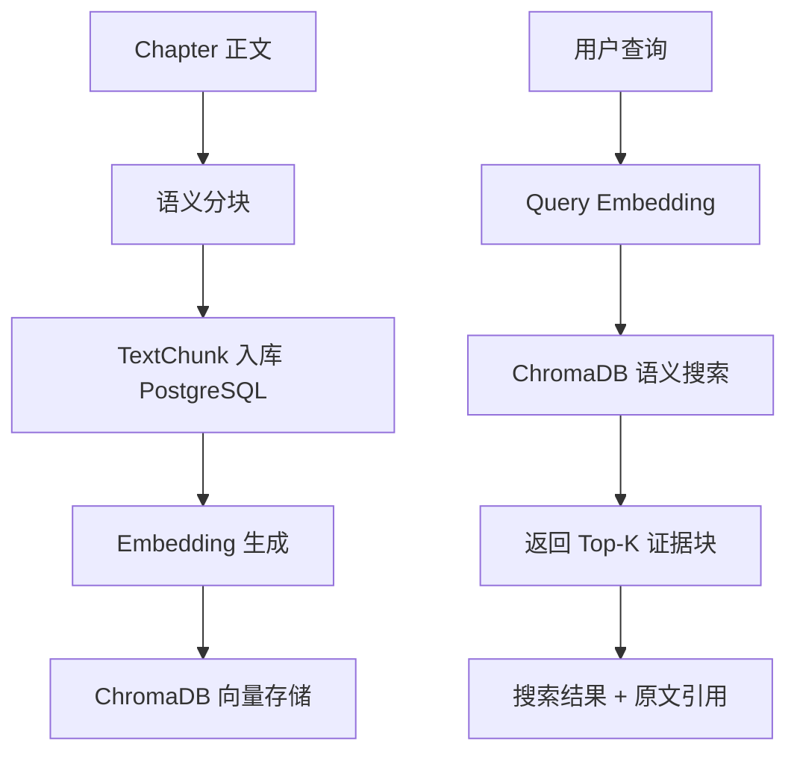

# 06 — RAG 管线

检索增强生成（Retrieval-Augmented Generation）管线。将小说内容转化为语义可搜索的向量索引。

## 管线概览



## 各阶段详解

### 1. 语义分块（chunking_service）

**来源**: `backend/app/services/chunking_service.py`（10.4KB）

分块策略：

| 层级 | 粒度 | 策略 |
|---|---|---|
| 一级 | 章节 | 按 Chapter 自然边界 |
| 二级 | 场景 | 按空行/场景转换 |
| 三级 | 段落 | 按自然段 300-500 字 |

分块参数：

- 目标大小：300-500 字 / chunk
- 重叠：0（不重叠，保持语义独立）
- 块类型检测：scene / dialogue / description / narration / paragraph

每个 TextChunk 存储到 PostgreSQL：

```python
TextChunk(
    novel_id=novel.id,
    chapter_id=chapter.id,
    chunk_index=i,
    content=chunk_text,
    chunk_type=detected_type,  # scene / dialogue / ...
    metadata_json={"characters": [...], "location": "...", "time": "..."},
    word_count=len(chunk_text),
    embedding_status="pending"
)
```

### 2. Embedding 生成（ai_service）

**来源**: `backend/app/services/ai_service.py`（4.9KB）

通过 LiteLLM 调用 OpenAI-compatible embedding API：

```
TextChunk.content
  → LiteLLM embedding API
  → 768 维向量
  → 返回 numpy/list
```

使用 AI 路由层（`ai_router.py`）选择最优 embedding 模型。

### 3. 向量存储（vector_store）

**来源**: `backend/app/services/vector_store.py`（9.1KB）

ChromaDB 配置：

| 参数 | 值 |
|---|---|
| 连接方式 | HTTP API (`http://localhost:8001`) |
| Collection 命名 | `novel_{novel_id}` |
| 向量维度 | 768（取决于 embedding 模型） |
| 距离度量 | cosine |
| Metadata | novel_id, chapter_id, chunk_index, chunk_type |

API：

```python
# 写入
await vector_store.add_embeddings(
    collection_name=f"novel_{novel_id}",
    ids=[chunk_ids],
    embeddings=[vectors],
    metadatas=[metadata],
    documents=[texts]
)

# 搜索
results = await vector_store.search(
    collection_name=f"novel_{novel_id}",
    query_embedding=query_vector,
    n_results=top_k
)
```

### 4. 搜索 API（rag.py）

**来源**: `backend/app/api/rag.py`（4.5KB）

端点：

| 方法 | 路径 | 功能 |
|---|---|---|
| `POST` | `/api/rag/search` | 语义搜索：query → embedding → ChromaDB 查询 → 返回 top-k 结果 |
| `POST` | `/api/rag/index/{novel_id}` | 触发索引：章节 → 分块 → embedding → 写入 ChromaDB |
| `GET` | `/api/rag/index/{novel_id}/status` | 查询索引进度 |

搜索请求：

```json
{
  "query": "路明非和诺诺第一次见面",
  "novel_id": 1,
  "top_k": 5
}
```

搜索响应：

```json
{
  "results": [
    {
      "chunk_id": 42,
      "content": "路明非抬起头，看见...",
      "score": 0.89,
      "chapter_id": 3,
      "chapter_title": "第3章 卡塞尔之门",
      "chunk_type": "scene"
    }
  ]
}
```

## 索引管线（indexing_service）

**来源**: `backend/app/services/indexing_service.py`（11.6KB）

协调各阶段并报告进度：

```python
async def index_novel(novel_id: int) -> dict:
    # 1. 获取小说和所有章节
    # 2. 对每章执行 chunking_service.chunk()
    # 3. 将 TextChunk 存储到 PostgreSQL
    # 4. 对 chunks 执行 ai_service.embed()
    # 5. 将 embeddings 写入 ChromaDB
    # 6. 更新 TextChunk.embedding_status = 'embedded'
    # 7. 返回进度报告
```

进度追踪通过内存字典，服务重启后丢失（将在 02-03 改善）。

## ChromaDB 集合管理

每个小说有独立的 ChromaDB collection：`novel_{novel_id}`

```python
# 删除小说时清理向量数据
await vector_store.delete_collection(f"novel_{novel_id}")
```

## PostgreSQL 与 ChromaDB 一致性

| 风险 | 当前处理 |
|---|---|
| TextChunk 存储成功，embedding 失败 | embedding_status='failed'，可重试 |
| PostgreSQL 删除，ChromaDB 残留 | 删除小说时执行 collection 清理 |
| ChromaDB 写入失败 | 返回错误，标记对应 chunks |
| 两库并发不一致 | 暂无事务协调机制（已知缺口） |

## 质量评估缺口

当前 RAG 管线缺少：

- 检索质量评估（recall/precision）
- 分块策略效果对比
- 不同 embedding 模型的效果对比
- 用户反馈收集机制

## 测试验证

```bash
cd backend
source venv/Scripts/activate

# 分块测试
pytest tests/test_chunking.py -v

# 向量存储测试
pytest tests/test_vector_store.py -v

# RAG 端到端测试
pytest tests/test_rag.py -v
```

## 修改后验证

修改 RAG 管线任何组件后，必须：

1. 运行对应模块测试
2. 手动导入一个小文件（如 `test_novel.txt`），触发完整索引入
3. 执行语义搜索，验证结果相关性
