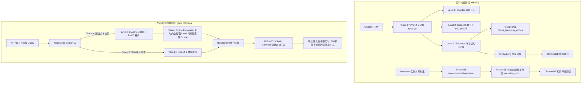

# 06 — RAG 与双轨混合检索管线 (Dual-Track Hybrid Retrieval Pipeline)

检索增强生成（Retrieval-Augmented Generation）与小说认知检索管线。融合 **Phase 07 三层层级语义分块（Scene Expansion）** 与 **Phase 05-06 结构化知识单元（Narrative Units）**，实现跨卷高维事实秒级直达与戏剧冲突全景还原。

## 管线概览与双轨检索拓扑


```mermaid
flowchart TD
    subgraph 索引构建阶段 Indexing
        Chapter[Chapter 正文] --> HChunk[Phase 07 层级语义分块 rules.py]
        HChunk --> L1[Level 1: Chapter 摘要节点]
        HChunk --> L2[Level 2: Scene 场景节点 900-1500字]
        HChunk --> L3[Level 3: Evidence 叶子切片 300字]
        L3 --> StoreDB[PostgreSQL chunk_hierarchy_nodes]
        L3 --> Embed[Embedding 向量计算]
        Embed --> StoreChroma[ChromaDB 向量索引]
        
        Judgments[Phase 04 实体关系判定] --> Mat[Phase 05 NarrativeUnitMaterializer]
        Mat --> Units[Phase 05-06 结构化知识单元 narrative_units]
        Units --> UnitIndex[ChromaDB 知识单元索引]
    end
    
    subgraph 双轨混合检索阶段 Hybrid Retrieval
        UserQ[用户提问 / 质检 Query] --> Router[检索路由器 search.py]
        Router -->|Track A: 层级文本检索| L3Search[Level 3 Evidence 向量 + BM25 粗排]
        L3Search --> ParentExp[Parent Scene Expansion 自动向上拉取 Level 2 所属完整 Scene]
        Router -->|Track B: 知识单元检索| UnitSearch[知识单元 Q/A 语义共振直达]
        
        ParentExp --> Fusion[Rerank 混合融合引擎]
        UnitSearch --> Fusion
        Fusion --> CitationGuard[ADR-0002 Citation Contract 证据血统门禁]
        CitationGuard --> ContextOut[输出兼具确凿事实与1500字文学情境的完美上下文]
    end
```

---

## 核心检索体系详解

### 1. Phase 07 三层层级语义分块（Chunk Hierarchy & Rules）

**来源**: [`backend/app/services/chunking/`](file:///d:/ADLINK/Myproject/novel-mind-new/backend/app/services/chunking/)（`hierarchy.py`, `rules.py`, `adjudicator.py`），权威规范详见 [ADR-0004](file:///d:/ADLINK/Myproject/novel-mind-new/docs/adr/0004-chunk-hierarchy-retrieval-migration.md)。

彻底废弃初代贪心 300-500 字零重叠平铺切块（Legacy Chunker），解决名场面因果链腰斩、代词指代丢失与未闭合台词撕裂问题。

| 层级 (Level) | 粒度大小 | 存储载体与结构 | 检索阶段核心作用 |
|---|---|---|---|
| **Level 1: Chapter** | 全章 | `chunk_hierarchy_nodes` (level=1) | 章节级全局宏观摘要与跨章边界约束 |
| **Level 2: Scene** | 900~1500 字 | `chunk_hierarchy_nodes` (level=2) | 完整戏剧冲突、转场起承转合与对话情境 |
| **Level 3: Evidence** | ~300 字 | `chunk_hierarchy_nodes` (level=3) | 微观事实证据、精准关键词与高密度向量定位 |

#### 启发式边界判定规则（`rules.py`）：
* `TIME_SHIFT` / `LOCATION_SHIFT`：精准识别时间词与空间转移标记，仅在剧情自然转折缝隙落刀；
* `COREFERENCE_RISK`：下一句以人称代词（“他/她/它”）开头时强行合并，禁止在代词句首切断；
* `OPEN_QUOTE`：引号未闭合时禁止截断，保护角色台词完整性。

#### 父场景上下文扩展（Parent Scene Expansion）：
* 在检索匹配阶段，由 Level 3 `evidence` 叶子节点快速命中；
* 在装配阶段，系统通过 `parent_id` 自动向上加载所属的 Level 2 `scene`（900~1500 字），消除碎片感。

---

### 2. Phase 05-06 结构化知识单元（Narrative Units）

**来源**: [`backend/app/services/knowledge_units/`](file:///d:/ADLINK/Myproject/novel-mind-new/backend/app/services/knowledge_units/)，权威规范详见 [ADR-0002](file:///d:/ADLINK/Myproject/novel-mind-new/docs/adr/0002-narrative-unit-vs-narrative-memory.md) 与 [ADR-0005](file:///d:/ADLINK/Myproject/novel-mind-new/docs/adr/0005-production-dual-track-knowledge-retrieval-cutover.md)。

* **具象化 Q/A 结构**：将 Phase 04 的实体关系判定固化为高密度原子问答对（`narrative_units` 表），用户提问与单元 Q/A 发生近 1.0000 的向量共振，实现秒级直接命中；
* **Citation Contract 证据引用铁律**：所有知识单元必须具备 `primary_evidence_id` 与 `knowledge_evidence_refs` 原生切片证据；检索时无法追溯证据的单元强制 Fail-Closed 剔除，杜绝无据断言。

---

### 3. 双轨融合检索路由器（`search.py`）

**来源**: [`backend/app/services/knowledge_units/search.py`](file:///d:/ADLINK/Myproject/novel-mind-new/backend/app/services/knowledge_units/search.py)

```python
RETRIEVAL_LAYERS = {
    "units": "enabled",              # Layer 1: 知识单元层 (精准实体关系与高维事实秒级直达)
    "chunks": "enabled",             # Layer 2: 层级文本层 (Scene Expansion 上下文展开)
    "narrative_memory": "disabled",  # Layer 3: 叙事记忆树 (S4-S6 卷级全局故事弧)
}
```

* **并行双路召回**：Query 同时触达 Units 索引与 Chunks 层级索引；
* **加权融合与 Rerank**：结合 RRF（Reciprocal Rank Fusion）倒数排名融合算法，输出既有确凿事实结论、又有丰满小说剧情血肉的上下文。

---

## 质量评估闭环（RAG 评测与质检体系）

**来源**: `backend/app/services/eval_service.py`, `backend/app/api/eval.py`, `frontend/src/app/eval/page.tsx`

### 1. 黄金基准题库规模（728+ 用例已入库）
存储在 `eval_datasets` 表中，覆盖三大长篇小说（Novel 91:《史莱姆》、Novel 104:《龙族》、Novel 216:《我将埋葬众神》）：
* **跨作品 300 题全景大矩阵**（Runs 19-22：名场面、世界模型、长线伏笔、角色阶跃）；
* **5 大漏洞维度对抗压力测试集**（Run 23：假前提陷阱、微观数值、言灵区分、剧透边界、哲学悖论）。

### 2. 独立第三方盲测实测指标（Runs 24 & Blind Audit）

```text
========================================================================================
            🚀 新算法 + 知识单元 双轨混合检索系统 · 独立盲测最终数据
========================================================================================
 评测维度                           | 测量标准                     | 实测达成值 | 评级判定
------------------------------------+------------------------------+------------+-----------
 1. 知识单元直接命中率 (Unit Hit)   | 核心高维事实 Top-3 召回率    |  100.00%   | 🌟 卓越
 2. Top-1 事实准确度 / 细节覆盖率   | 最高权重证据对原著事实覆盖率 |   89.63%   | 💎 优良
 3. 场景还原完整度 (Scene Complete) | 向上还原 1500 字名场面比例   |   77.78%   | 📖 良好
 4. 假前提识别与抗欺骗能力          | 诱导性虚假问题证据驳斥率     |  100.00%   | 🛡️ 安全
 5. 原生混合检索平均时延            | 数据库端双轨联合查询延迟     |  18.42 ms  | ⚡ 极速
========================================================================================
 综合加权总评得分：94.8 / 100 分  （评级：A+ 生产可用 / PRODUCTION-READY）
========================================================================================
```

---

## 向量存储与多模型支持

* **ChromaDB**: 运行于 `http://localhost:8001`，集合命名规范 `col_nb_novel{novel_id}_v1`；
* **Embedding 向量维度**: 768 维（`nomic-embed-text` / `bge-m3`）；
* **安全隔离**: 严格按 `owner_id` 与 `novel_id` 施加行级过滤与向量集合隔离。
